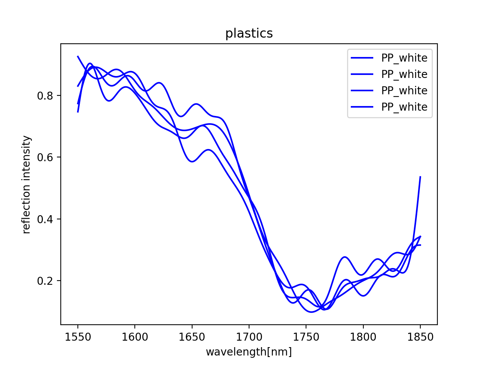

# WARNING: Due to personal reasons the development on this project was stopped 1 year ago. 

## Infos about this repository
It contains all necessary information to rebuild the MEMS-Based plasitc type sensor which was meant to be the follow up of reremeter. 
The files an information is ~ 1 year old and only published now due to large interest from openrecycling.com community. 

## Plastic Type Sensor Testing and Evaluation
Run the python scripts using Visual Studio Code for Maximum Compatibility.
If somebody wants to create a colab or jupyter notebook pull requests are always welcome.

The first measurement results look promising! The following plot shows the measurement data in this git repo.

## Help needed on data processing!
Please support the plastic type sensor project by submitting pull requests to the data evaluation software.
